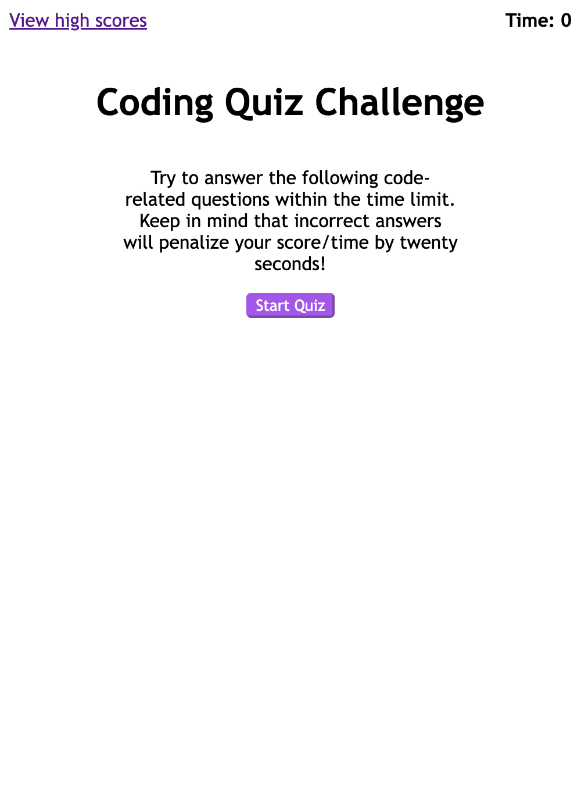

# code-quiz

## Description

This is a code quiz game to test your JavaScrip fundamentals. The quiz is timed with 75 seconds. Each wrong answer will deduct 20s out of your total time. Once you answer all questions or time runs out, the quiz will be over. You will have chance to store your initials and scores. 

## Run the website

You can open the website by clicking here. 
https://dark40.github.io/code-quiz/

## Screenshots

